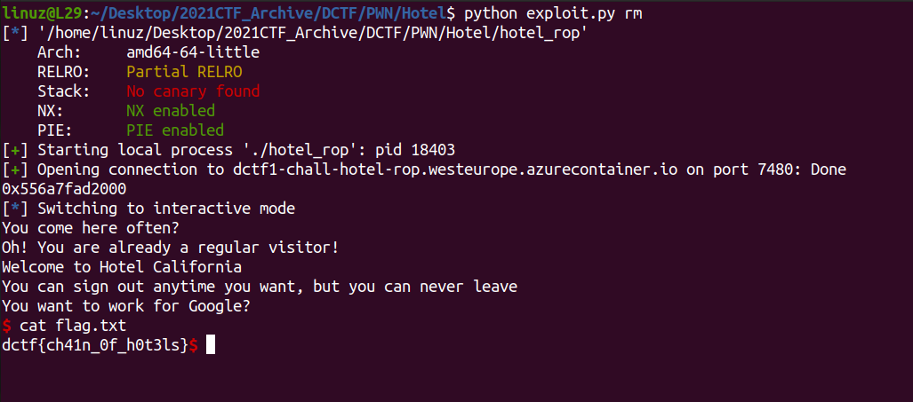

# Hotel ROP

Bufferoverflow bug again in the **vuln()** function

```c
int vuln()
{
  int result; // eax
  char s[28]; // [rsp+0h] [rbp-20h] BYREF
  int v2; // [rsp+1Ch] [rbp-4h]

  puts("You come here often?");
  fgets(s, 256, stdin);
  if ( v2 )
    result = puts("I think you should come here more often.");
  else
    result = puts("Oh! You are already a regular visitor!");
  return result;
}
```

And there's **loss()** function that call **system()**
```c
int __fastcall loss(int a1, int a2)
{
  int result; // eax

  result = a1 + a2;
  if ( a1 + a2 == 0xDEADC0DE )
  {
    result = puts("Dis is da wae to be one of our finest guests!");
    if ( a1 == 0x1337C0DE )
    {
      puts("Now you can replace our manager!");
      system(win_land);
      exit(0);
    }
  }
  return result;
}
```

And there's **california()** and **silicon_valley** function that add `win_land = '/bin/sh'`
```c
__int64 california()
{
  puts("Welcome to Hotel California");
  puts("You can sign out anytime you want, but you can never leave");
  win_land[len++] = '/';
  win_land[len++] = 'b';
  win_land[len++] = 'i';
  win_land[len] = 'n';
  return (unsigned int)++len;
}

__int64 silicon_valley()
{
  puts("You want to work for Google?");
  win_land[len++] = '/';
  win_land[len++] = 's';
  win_land[len++] = 'h';
  win_land[len] = 0;
  return (unsigned int)++len;
}
```

**PIE** was enabled in this program, but program also give address of **main**, so we can easily leak the **PIE**

Now all we need to do is make ROP 
`california() -> silicon_valley -> system(win_land)`

We dont need to call **loss()** function, just jump to **system(win_land)** instead

[Full Sript](https://github.com/L29/Binary-Writeup/blob/main/dCTF/Hotel%20ROP/exploit.py)


