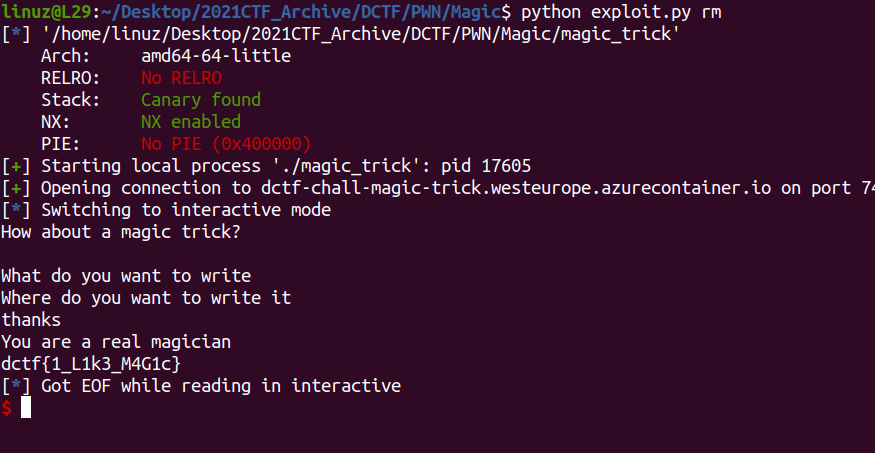

# Magic trick

Arbitary write in **magic()** function

```c
unsigned __int64 magic()
{
  __int64 v1; // [rsp+0h] [rbp-20h] BYREF
  _QWORD *v2; // [rsp+8h] [rbp-18h] BYREF
  unsigned __int64 v3; // [rsp+18h] [rbp-8h]

  v3 = __readfsqword(0x28u);
  puts("What do you want to write");
  __isoc99_scanf("%llu", &v1);
  puts("Where do you want to write it");
  __isoc99_scanf("%llu", &v2);
  puts("thanks");
  *v2 = v1;
  return __readfsqword(0x28u) ^ v3;
}
```

The program simple like this

```py
payload = 0xdeadbeef
target = exit_address()
exit_adress() = 0xdeadbeef
```

And there's **win()** function in this program
```c
void __noreturn win()
{
  puts("You are a real magician");
  system("cat flag.txt");
  exit(1);
}
```

In **main()** function program use **ret** and not **exit** so we cant overwrite **exit_GOT** to **win**

What address we should overwrite?

Well we can overwrite **fini_array** to **win**, because when program **ret** it will call that address


[Full Sript](https://github.com/L29/Binary-Writeup/blob/main/dCTF/Magic%20trick/exploit.py)


