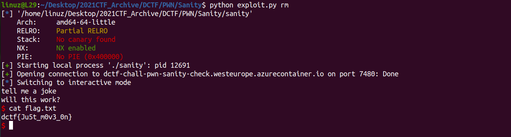

# Pwn sanity check

Basic Bufferoverflow in the **vuln()** function

```c
int vuln()
{
  char s[60]; // [rsp+0h] [rbp-40h] BYREF
  int v2; // [rsp+3Ch] [rbp-4h]

  puts("tell me a joke");
  fgets(s, 256, stdin);
  if ( v2 != 0xDEADC0DE )
    return puts("will this work?");
  puts("very good, here is a shell for you. ");
  return shell();
}
```

and there is a **win()** function in this program

```c
int __fastcall win(int a1, int a2)
{
  int result; // eax

  result = puts("you made it to win land, no free handouts this time, try harder");
  if ( a1 == 0xDEADBEEF )
  {
    result = puts("one down, one to go!");
    if ( a2 == 0x1337C0DE )
    {
      puts("2/2 bro good job");
      system("/bin/sh");
      exit(0);
    }
  }
  return result;
}
```

Welp i solve this without following the conditions in **win** function.
Just need jump to **system('/bin/sh')**

```
.text:00000000004006DB                 lea     rdi, command    ; "/bin/sh" << jump to here
.text:00000000004006E2                 call    _system
```

dont forget to add some **ret** for bypass the allignment

[Full Sript](https://github.com/L29/Binary-Writeup/blob/main/dCTF/PWN%20sanity%20check/exploit.py)


