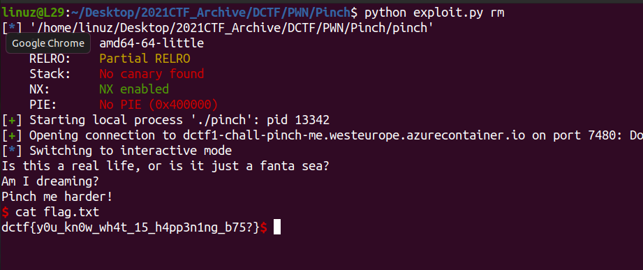

# Pinch me

Basic Bufferoverflow in the **vuln()** function

```c
int vuln()
{
  char s[24]; // [rsp+0h] [rbp-20h] BYREF
  int v2; // [rsp+18h] [rbp-8h]
  int v3; // [rsp+1Ch] [rbp-4h]

  v3 = 0x1234567;
  v2 = 0x89ABCDEF;
  puts("Is this a real life, or is it just a fanta sea?");
  puts("Am I dreaming?");
  fgets(s, 100, stdin);
  if ( v2 == 0x1337C0DE )
    return system("/bin/sh");
  if ( v3 == 0x1234567 )
    return puts("Pinch me!");
  return puts("Pinch me harder!");
}
```

Same like [PWN Sanity check](https://github.com/L29/Binary-Writeup/tree/main/dCTF/PWN%20sanity%20check)

Solve this without following the conditions.
Just need jump to **system('/bin/sh')**

```
.text:00000000004011A1                 lea     rdi, command    ; "/bin/sh" << jump to here
.text:00000000004011A8                 call    _system
```

dont forget to add some **ret** for bypass the allignment

[Full Sript](https://github.com/L29/Binary-Writeup/blob/main/dCTF/Pinch/exploit.py)


