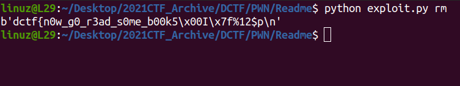

# Readme

Formatstring bug in the **vuln()** function

```c
unsigned __int64 vuln()
{
  FILE *stream; // [rsp+8h] [rbp-58h]
  char s[32]; // [rsp+10h] [rbp-50h] BYREF
  char format[40]; // [rsp+30h] [rbp-30h] BYREF
  unsigned __int64 v4; // [rsp+58h] [rbp-8h]

  v4 = __readfsqword(0x28u);
  stream = fopen("flag.txt", "r");
  fgets(s, 28, stream);
  fclose(stream);
  puts("hello, what's your name?");
  fgets(format, 30, _bss_start);
  printf("hello ");
  printf(format); 		// << here format string
  return __readfsqword(0x28u) ^ v4;
}
```

Program read the **flag.txt** and stored it to the stack.

If we send `%p` program will print some address in stack. That mean we can leak the flag with formatstring attack

[Full Sript](https://github.com/L29/Binary-Writeup/blob/main/dCTF/Readme/exploit.py)


